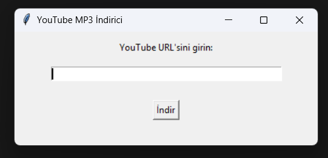

````markdown
# 🎵 YouTube MP3 İndirici (GUI)

Bu proje, YouTube videolarını kolayca MP3 formatında indirmenizi sağlayan basit ve kullanıcı dostu bir Python arayüzüdür.  
`yt-dlp` ve `tkinter` kütüphaneleri kullanılarak geliştirilmiştir.

## 🚀 Özellikler

- Basit ve kullanımı kolay grafik arayüz (GUI)
- **Video bağlantısı içindeki oynatma listesi parametresini algılar ve sadece o videoyu indirir**
- MP3 formatında yüksek kaliteli ses çıktısı (192 kbps)
- Hataları kullanıcıya bildirir

---

## 🔧 Kurulum

Aşağıdaki komutlarla gerekli bağımlılığı kurabilirsiniz:
````
```bash
pip install yt-dlp
````

Güncel sürümünü yüklemek için:

```bash
python -m pip install -U yt-dlp

# Alternatif:
yt-dlp -U
```

> ⚠️ Not: `ffmpeg` sisteminizde yüklü olmalıdır.
> [FFmpeg Nedir? Video ve Ses Format Dönüştürme, Düzenleme ve Daha Fazlası | Detaylı Anlatım](https://youtu.be/iS9Lz8Vg2f4?feature=shared)

---

## ▶️ Kullanım

> [Programın detaylı anlatım ve kullanımını izlemek için tıklayınız.](https://youtu.be/)

```bash
python main.py
```

Uygulama açıldıktan sonra:

1. YouTube video URL'sini girin.
2. "İndir" butonuna tıklayın.
3. Video MP3 formatında kaydedilecektir.

---

## 🛠 Geliştirici Notları

* Oynatma listesi linki verildiğinde sadece ilk videonun indirilmesini istiyorsanız `ydl_opts` içine şu satırı ekleyin:

```python
'playlistend': 1,
```

* Daha fazla kontrol için [yt-dlp belgelerini inceleyin](https://github.com/yt-dlp/yt-dlp).

---

## 📌 Ekran Görüntüsü

> 

---

## 🧠 İleriye Dönük Planlar

* İndirme sırasını gösteren ilerleme çubuğu
* İndirilen dosyayı açma/kaydetme konumunu değiştirme
* Sadece ses değil, video da indirme seçeneği

---

## 🧑‍💻 Katkı

Pull request'ler ve öneriler memnuniyetle karşılanır.
Hataları [issue sekmesinden](https://github.com/egecher/youtube-mp3-converter/issues) bildirebilirsiniz.

---

## 📝 Lisans

MIT Lisansı altında yayınlanmıştır.
Detaylar için [LICENSE](https://github.com/Egecher/youtube-mp3-converter/blob/main/LICENSE) dosyasına bakın.